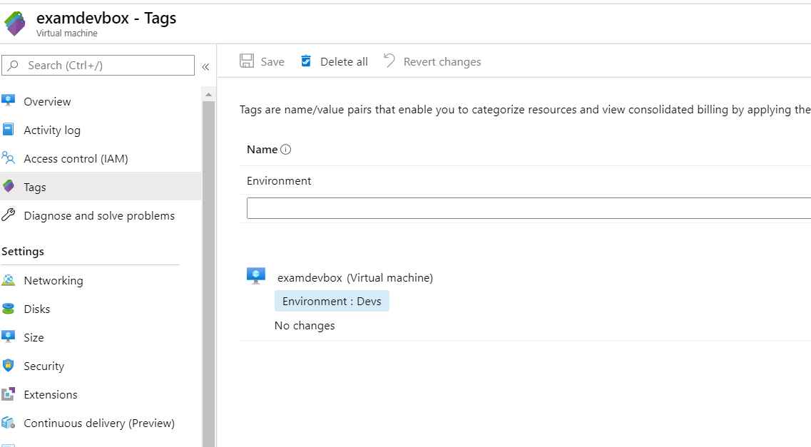
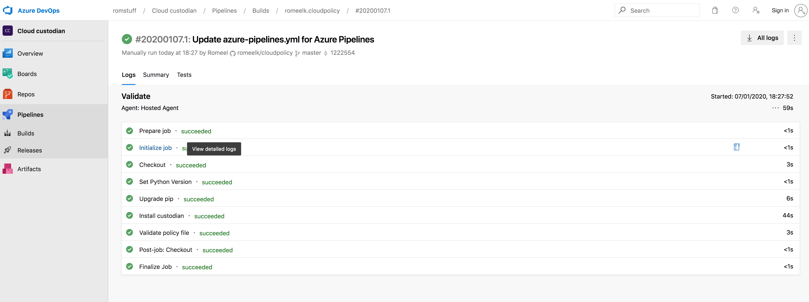

## Cloud Governance with Cloud Custodian

I have recently being doing some work around governance and compliance in Azure using Azure policy. Azure policy is the out of the box
policy engine that Microsoft provide as part of your Azure subscription. It uses a declarative syntax using JSON to define policies
(security, audits and others) governing your compute, network and storage resources. Azure policy can be used to prevent resources
from being provisioned if not compliant with a policy as a well as provding information on policy for governance and audit purposes as well.
Please refer to the official documentation for further details: https://docs.microsoft.com/en-us/azure/governance/policy/overview

One of my friends who works in security and risk mentioned an open source tool called Cloud Custodian. Being interested in open source
i decided to check it out.

## Multi cloud rules engine

Cloud Custodian is a rules engine that can be used against different Cloud providers (AWS, Google, Azure) for security, compliance and apply actions on cloud resources.
I would term it as compliance/security as code. Please check https://cloudcustodian.io for further information.

## How it works

Cloud custodian is written in Python. 

Conceptually Cloud custodian makes use of the following:
 * The resource type you are going to run a policy against (S3 bucket (AWS), Blob Storage (Azure))
 * A filter which applies to a specific resource in a Cloud provider
 * Actions that will be applied to produce a policy effect on those filtered resources

## Trying it out on Azure

I have been working with Azure for a couple of years so this page will show examples in Azure. I will follow up with 
an AWS example in a future post.

Before jumping into a deep dive read the following to install it on your machine of choice. 
https://cloudcustodian.io/docs/quickstart/index.html#explore-cc

I decided to install it on my Mac.

As it is a Python based tool it installs a Python virtual environment so you can sandbox the python dependencies.

Cloud custodian will authenticate with Azure AD so it can perform actions at the management plane.

To do this you need to create a Service principal and use the credentials in your bash session:

```
# create Service Principal
az ad sp create-for-rbac --name policy-sp

{
   "appId": "03529a99-57db-479f-b200-2c444917481d",
   "displayName": "policy-sp",
   "name": "http://policy-sp",
   "password": "b13ec007-4e63-47ef-a00f-e78ffb160733", 
   "tenant": "0893480d-4a15-4aa8-b46b-75e6bf0a63de"
}

```
Once your service principal has been created take the appId (use as CLIENT_ID), tenant and password (use as CLIENT_SECRET)
from the previous cli command to set the shell variables:

```
AZURE_TENANT_ID=0893480d-4a15-4aa8-b46b-75e6bf0a63de
AZURE_SUBSCRIPTION_ID=880c301f8-0098-4963-8ef1-f53ae4a6173
AZURE_CLIENT_ID=03529a99-57db-479f-b200-2c444917481d
AZURE_CLIENT_SECRET=b13ec007-4e63-47ef-a00f-e78ffb160733
```
Once complete you are ready to create your own policies!!
Next use azure cli to set your default subscription

```
az account set --subscription 80c301f8-0098-4963-8ef1-f53ae4a6173
```

## Defning my first policy

So using the example from Cloud custodian article I decided to create try out the policy to tag an existing VM.
I have an existing VM called ExamVm in a dev Azure subscription.
```
policies:
    - name: add-vm-tag-policy
      description: |
        Adds a tag to a virtual machines
      resource: azure.vm
      filters:
        - type: value
          key: name
          value: examdevbox
      actions:
       - type: tag
         tag: Environment
         value: Devs
```
Destilling the above the key components are:
* resource: azure.vm - This is the compute provider in Azure
* filters: filter for on a compute vm with a value of: ExamVM
* actions: Add the tag called Environment  with the value Dev

For further information on filters:https://github.com/cloud-custodian/cloud-custodian/blob/master/docs/source/filters.rst


Using the cloud custodian cli I can now apply the policy!:

```
custodian run --output-dir=. addtag.yml
2020-01-07 11:43:47,304: custodian.azure.session:INFO Authenticated [Azure CLI | 8669867b-c6be-419c-8aff-e49945115767]
2020-01-07 11:43:48,006: custodian.policy:INFO policy:add-vm-tag-policy resource:azure.vm region: count:1 time:0.70
2020-01-07 11:43:48,009: custodian.azure.tagging.Tag:INFO Action 'tag' modified 'examdevbox' in resource group 'RG-MVP-EXAMDEVBOX'.
2020-01-07 11:43:48,014: custodian.policy:INFO policy:add-vm-tag-policy action:tag resources:1 execution_time:0.01
```

Once the policy engine runs it prints out the result. In the above example it found a VM called ExamVM in resource group 
and tagged it!

See screenshot:



## Validating your policy

Its good to see the CLI has a validate argument. I introduced a typo into the policy (bad code):
```
policies:
    - name: add-vm-tag-policy
      description: |
        Adds a tag to a virtual machines
      resource: azure.vm
      filters:
        - type: value
          key: name
          value: examdevbox
      actions:
       - type: tag
         tag: Environment
         value: Devs
         bad code
```

Running the validate command (output truncated): 
```
custodian validate addtag.yml
Traceback (most recent call last):
  File "/Users/romeelkhan/development/Policies/custodian/bin/custodian", line 11, in <module>
    load_entry_point('c7n==0.8.45.3', 'console

```
This helps the failure feedback loop, because once in a CI/CD pipeline you can make sure your teams are not checking in
policies whose syntax is incorrect!

## Running reports

I followed the online docs to run the report but was having no luck. After a few tries i got it working:

```
custodian report --output-dir=. --format grid --field tags=tags addtag.yml

+------------+------------+-------------------+-------------------------------------+-------------------------+
| name       | location   | resourceGroup     | properties.hardwareProfile.vmSize   | tags                    |
+============+============+===================+=====================================+=========================+
| examdevbox | westeurope | RG-MVP-EXAMDEVBOX | Standard_F8s_v2                     | {'Environment': 'Devs'} |
+------------+------------+-------------------+-------------------------------------+-------------------------+
```

Make sure you run custodian run before as it uses the resources.json generated for the policy file!

## Pipeline first steps

So we have demonstrated it from the CLI. But the reality is in most organizations teams develop software, products, update and manage cloud infrastructure.
This means to make this process consistent and repeatable and driven from changes made via source control we need a CI pipeline. In this example, I will
use an Azure pipeline using Azure DevOps. This can be applied to any other CI tool of choice such as Jenkins or Git Lab ..

To accomplish this I created a public project in my Azure DevOps organization. I then integrated Azure pipelines with Github as the source control. This allowed me to
create the following:

```
trigger:
- master

jobs:
  - job: 'Validate'
    pool:
      vmImage: 'Ubuntu-16.04'
    steps:
      - checkout: self
      - task: UsePythonVersion@0
        displayName: "Set Python Version"
        inputs:
          versionSpec: '3.7'
          architecture: 'x64'
      - script: pip install --upgrade pip
        displayName: Upgrade pip
      - script: pip install c7n c7n_azure
        displayName: Install custodian
      - script: custodian validate stopped-vm.yml
        displayName: Validate policy file
  ```

This simple pipeline is the equivalent of compiling code in a laneguage such as Java, C# and then getting feedback if the code checkin broke the build.

The key part is the script step 'Validate policy' file which is like a linter step to check the policy file.

Saving and running the pipeline produces:



## Other scenarios

The above demonstration was a small example of a policy effect. However, there are other scenarios organistaions may consider to increase
their security or governance of their cloud environment. These include for example cases such as:

* Preventing Public IP being provisioned
* Ensuring storage accounts are secured with HTTPS

Just like Azure policies Cloud custodian allows security to be baked into the development lifecycle through concepts such as shift left and fail fast.
By leveraging this tool via code and CI/CD practises security engineers/consultants, development teams and DevOps engineers can ensure security and governance are not an
afterthought.


## Next steps and my take on it

That was a pretty basic example of Cloud Custodian. Personally I prefer YAML syntax to JSON. For me JSON is very machine oriented
and the nesting becomes a real headache to understand. With YAML the definition is more human readable. 

To really make this repeatable and automated the CI/CD pipeline is a must. For me this is where 
policy engine tools become really useful. Organisations want to bake into their cloud environment lifecycle effective governance and security
instead of waiting for a manual gate (security team fails app) to fail just before an application goes into production.

